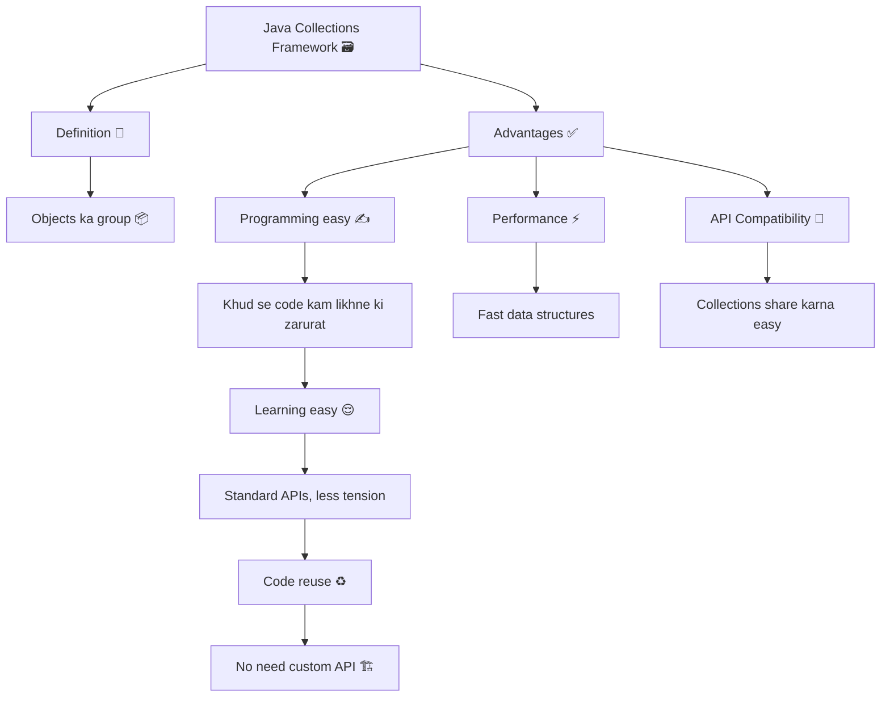
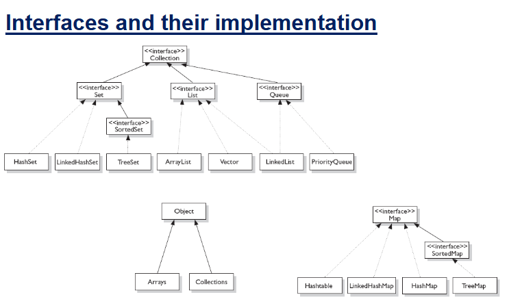
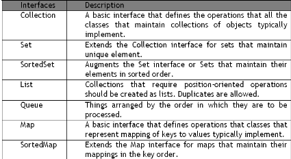
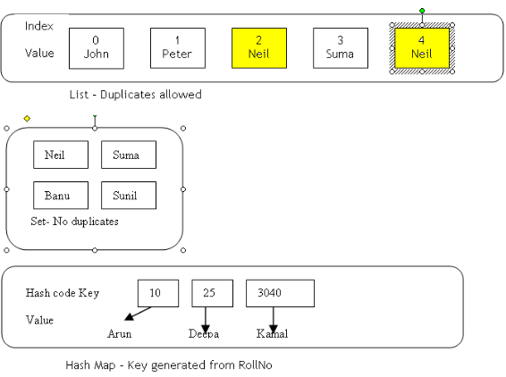
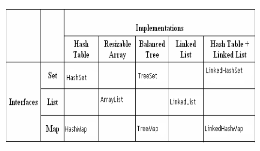
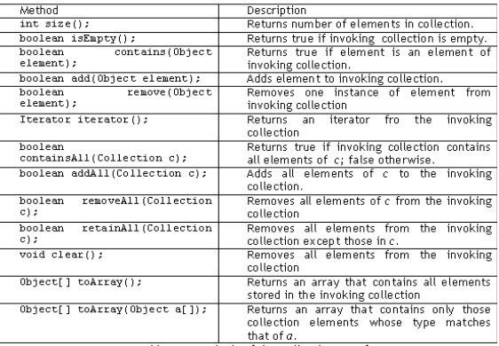

# Java Collections Framework

# Interfaces and their implementation

this is showing which collection has which data structure in it
* #### Set
  * HashSet, 
  * LinkedHashSet, 
  * SortedSet
    * TreeSet
* #### List
  * ArrayList, 
  * Vector, 
  * LinkedList
* #### Queue
  * PriorityQueue
* #### Map Interface
  * Hashtable, 
  * HashMap, 
  * LinkedHashMap,
  * SortedMap
    * TreeMap 

<strong>Set</strong> = No duplicates  
<strong>List</strong> = Order matters, duplicates allowed  
<strong>Queue</strong> = FIFO  
<strong>Map</strong> = Key-Value pairs

# Collection Interfaces

* **Collection** → Base interface sab collections ke liye.
* **Set** → Unique elements only.
* **SortedSet** → Set + elements sorted.
* **List** → Ordered collection, duplicates allowed.
* **Queue** → Elements order of processing mein.
* **Map** → Key–Value pairs.
* **SortedMap** → Map + keys sorted order mein.
  
Bas itna yaad rakh le — 
**Collection = group**, 
**Map = key-value**, 
**Sorted = order maintained**.

# Represetation

# Collection Implementations

* #### **HashSet** 
  – Unordered & unsorted set, **no duplicates**. HashCode efficient ho to fast access milta hai. **Order ki tension nahi**. 🔑

* #### **TreeSet** 
  – **Sorted set**, elements automatically tree structure me arranged hote hain. 📈
* ##### **LinkedHashSet** 
  – **HashSet ka ordered version**, iteration insertion order me hota hai. 🔄
* #### **ArrayList** 
  – **Growable array**, fast iteration & **random access**. **Ordered by index**, but not sorted. RandomAccess interface support karta hai. ⚡
* #### **LinkedList** 
  – ArrayList jaisa **index order**, par **elements doubly-linked** hote hain. Insert/delete me ArrayList se better. 🔗

# Collection interface methods
