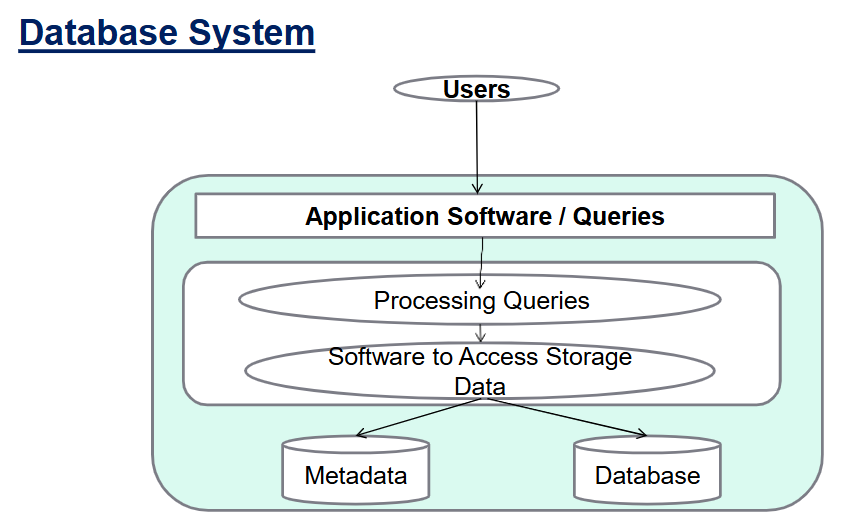
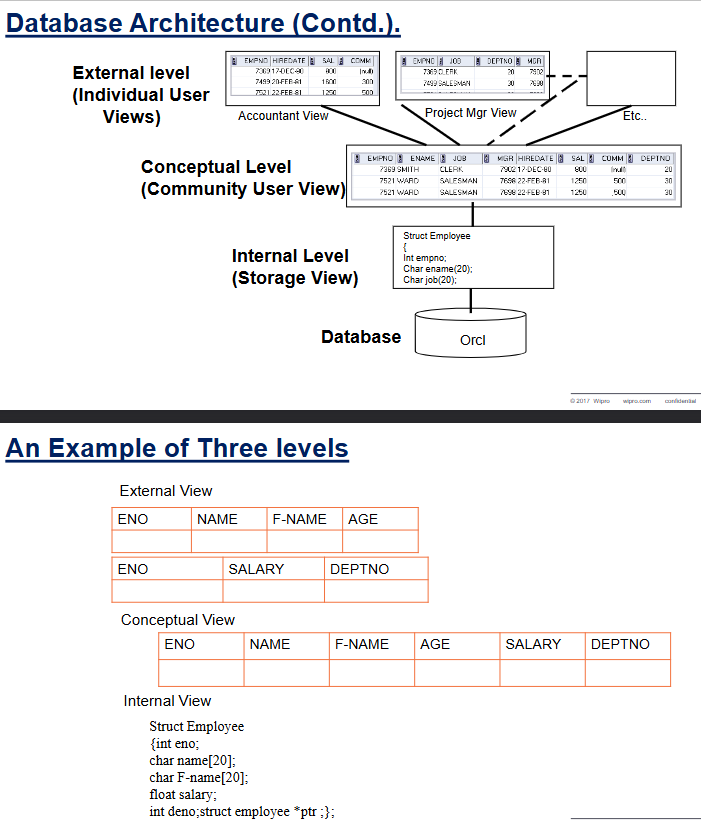
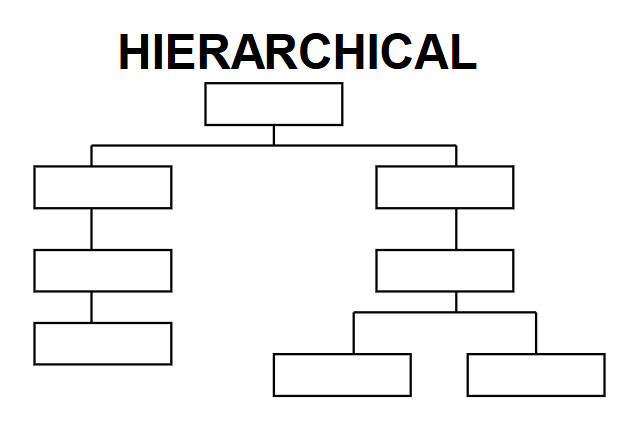
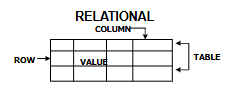
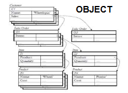

# FMS vs DBMS
| Feature           | **FMS (File Management System)**                                               | **DBMS (Database Management System)**                                    |
| ----------------- | ------------------------------------------------------------------------------ | ------------------------------------------------------------------------ |
| **Data Handling** | Programmer khud file se data store/retrieve karta hai (OS functions use karke) | User logical structure define karta hai, DBMS khud data handle karta hai |
| **Complexity**    | Simple system                                                                  | Complex system                                                           |
| **Cost**          | Kam kharcha                                                                    | High initial investment (software, hardware, training)                   |
| **Data Storage**  | Har program ke liye alag data                                                  | Data shared among users/programs                                         |
| **Redundancy**    | Zyada redundancy                                                               | Redundancy kam hoti hai                                                  |
| **Standards**     | Koi standard nahi                                                              | Standard enforced                                                        |
| **Security**      | No security control                                                            | Security & integrity maintained                                          |
| **Resource Use**  | Resources ka proper use nahi                                                   | Multiuser + resource utilization support                                 |
| **Best Use Case** | Small, simple apps; single user; less changes                                  | Large, centralized systems; multiuser access; huge data manipulation     |

#### 👉 Short mein yaad rakh:

**FMS** = “Khud karo, single-user ke liye theek”

**DBMS** = “System karega, multi-user ke liye best”

****

****

****

# Data Models

Data model basically **structure deta hai data ko**, taaki system aur applications compatible banein.
Types:
1. **Conceptual/Logical Model** → e.g., ER Diagram.

2. **Physical Model** → Hierarchical, Network, Relational, Object-Oriented.

3. **Representational Model** → Jo user-friendly representation deti hai.

****

# Types of Database Models
* **Hierarchical Model** → **Data tree ke form mein** hota hai. Search fast, lekin ek data multiple jagah link karna mushkil.
  

* **Network Model** → **Circular linked list** type **structure**. Powerful hai, but complex aur kam independence deta hai.
  

* **Relational Model** → **Data tables (rows-columns) ke form mein**. Most common, logical relations hoti hain.
  

* **Object-Oriented Model** → Data **objects ke form mein** hota hai (attributes = columns). Relation inheritance se hota hai (jaise OOP).
  

#### 👉 Ek line ka funda:

**FMS** = files tum sambhalo.

**DBMS** = system tumhari tension lega.

**Models** = bas alag-alag tareeke data organize karne ke.

****
****
****

# Intro to RDBMS

## 🔹 Definition
* DBMS kaafi complex tha, costly tha aur naye users ke liye tough.
* Isiliye aaya **Relational DBMS (RDBMS)** → Jaha **saara data tables (rows + columns) ke form mein store hota** hai.

## 🔹 Benefits of RDBMS
* **Multiple tables** bana sakte ho (**relations**).
* Query language **(SQL) se interact karna easy.**
* **Ek se zyada tables se data retrieve** kar sakte ho (**JOINs**).
* System tables (catalog/dictionary) bhi hoti hain jo DB ka info rakhti hain.

## 🔹 Important Terms
* **Relation** → Table
* **Tuple** → Row
* **Attribute** → Column
* **Degree** → Number of columns
* **Cardinality** → Number of rows
* **Primary Key** → Unique identifier (jaise Roll Number).
* **Domain** → Allowed values (jaise Gender ka domain = {M, F}).

## 🔹 Properties of Table (Relation)
* **Duplicate rows nahi** hote.
* **Rows (tuples) unordered** hote hain.
* **Columns (attributes) unordered** hote hain.
* Har value atomic hoti hai (**no repeating groups**).

## 🔹 Keys in RDBMS
* **Key** → Wo **attribute** jo **entity** ko **uniquely identify kare**.
* **Super Key** → Any **set** of attributes that can **uniquely identify** (e.g., RollNo + Name).
* **Candidate Key** → Minimal subset jo uniquely identify kare.
* **Primary Key** → Chosen candidate key (**main identifier**).
* **Alternate Key** → Candidate keys jo primary nahi banti.
* **Secondary Key** → **Non-unique keys** jo classification mein help kare (like Age).

## 🔹 Referential Integrity
* Matlab ek table ka **foreign key doosre table ke primary key ko refer kare**.
* Example:
    * **STUDENT table** (sid = primary key).
    * **ENROLLED table** (sid = foreign key jo STUDENT.sid ko refer karta hai).
* Ensures data consistency (no orphan records).

### 👉 Ek line ka funda:

**RDBMS** = Data in Tables (Rows + Columns)

**Keys** = Data ko uniquely identify karne ke tools

**Referential Integrity** = Tables ka relation hamesha valid rahe