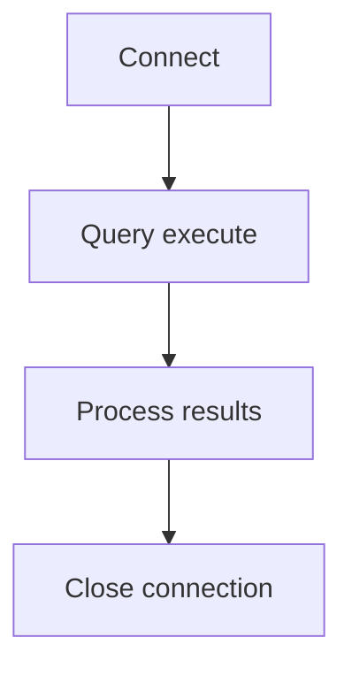

# 🔹JDBC
* **JDBC** = Java Database Connectivity.
* Ye ek **API** (Application Programming Interface) hai jo **Java programs ko databases se baat karne ka tareeka deta hai**.
* Basically, tum Java code likhte ho aur **JDBC use karke tumhara program database se connect ho ke data fetch/update kar sakta hai.**
* Saare classes aur interfaces `java.sql` package mein hote hain.
> **JDBc** helps JAVA prog to connect with database

## 🔹 JDBC se kya kya kar sakte ho?
1. **Connect with database**
2. **Run SQL queries** (`SELECT`, `INSERT`, `UPDATE`, `DELETE`).
3. Query ke results ko access karke process karna.
4. **Metadata lena** (matlab info about tables, columns etc).

## 🔹 JDBC Architecture

Simple process hai:

* Isme ek important **class** hoti hai `DriverManager` jo tumhara **program aur driver ke beech ka middleman hai**.

## 🔹 Steps to Connect
* **Driver load karo** (matlab JDBC driver jo tumhare database ke liye bana hai).
* **Connection establish karo** database ke saath.

**Driver** → **set of classes** → **jo tumhare JDBC calls ko database ke commands mein convert karta hai**.

## 🔹 Types of JDBC Drivers
JDBC drivers ke **4 types** hote hain:

#### 1) Type I – JDBC-ODBC Bridge Driver
* Java → ODBC → Database.
* **Sun Microsystems** ka diya hua driver.
* Local machine par **ODBC install hona** zaroori hai.
* Example: MS Access databases.
* Drawback: Pure Java solution nahi, aur production use ke liye recommend nahi.

#### 2) Type II – Native-API Driver
* Java → Native Libraries (OCI, etc.) → Database.
* **Fast** hota hai, kyunki **directly DB ke client libraries use karta hai**.
* Drawback: **Native libraries install karni padti hain**, portability kam hai.

#### 3) Type III – Network Protocol Driver
* Java → Middleware Server → Database.
* **Pure Java** hota hai (100% portable).
* **Middleware security**, **caching**, aur **connection control** handle karta hai.
* Achha option for **web apps**, lekin thoda **costly** ho sakta hai.

#### 4) Type IV – Thin Driver (Pure Java Driver)
* Java → Direct DB Protocol → Database.
* **Pure Java**, no installation needed.
* **Fastest** aur sabse zyada use hota hai (J2EE, Web apps).