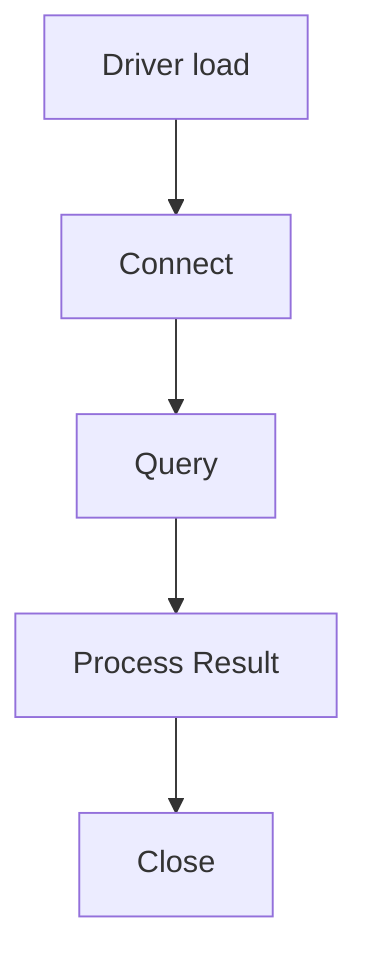
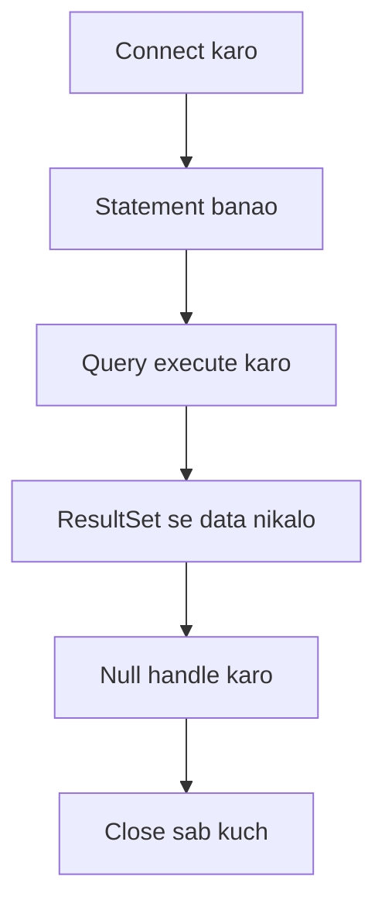

## 1️⃣ Query Execute Karna
* Connection ban jaane ke baad tum **Statement object se query bhejte ho**.
* Statement ke 3 tareeke hote hain:
    * #### 1️⃣ executeQuery()
        * Kya kaam: **SELECT statement run karta hai**.
        * **Return**: Hamesha **ResultSet** *(ek table jaisa object)*.
        * Use kab: **Jab tumhe DB se data read** karna ho.
        * 👉 Example:
        ```java
        ResultSet rs = stmt.executeQuery("SELECT name, age FROM student");
        ```
        Yaha tumhe ek **table milega jisme rows+columns honge**.

    * #### 2️⃣ executeUpdate()
        * Kya kaam: `INSERT`, `UPDATE`, `DELETE`, ya DDL (`CREATE TABLE`, `DROP TABLE`) **run karta hai**.
        * Return: **Ek int → kitni rows change hui.**
        * Use kab: Jab tum **DB me data change karna** chahte ho.
        👉 Example:
        ```java
        int rows = stmt.executeUpdate("DELETE FROM student WHERE id=101");
        System.out.println(rows); // 1 ya 0
        ```

        ##### ⚡ Quick rule yaad rakh:
        * **DML (INSERT/UPDATE/DELETE)** → return number of rows.
        * **DDL (CREATE/DROP/ALTER)** → `return` karega `0`.

    * #### 3️⃣ execute()
        * Kya kaam: Dono types handle kar sakta hai (SELECT bhi, aur UPDATE/DDL bhi).
        * Return: Ek boolean
          * **SELECT** → `true`
          * **Update/Delete/DDL** → `false`
        * 👉 Example:
        ```java 
        boolean hasResult = stmt.execute("SELECT * FROM student");
        if(hasResult){
        ResultSet rs = stmt.getResultSet();
        }else{
        int count = stmt.getUpdateCount();
        }
        ```
> **Query** → `executeQuery()`
**Update** → `executeUpdate()`
**Confused** → `execute()` (jab tumhe pata hi nahi hai SQL kya return karega)

> ⚡ Quick yaad rakhne ka funda:
`executeQuery()` → **ResultSet** hi laata hai
`executeUpdate()` → **Update count** hi laata hai
`execute()` → Sirf batata hai **kis type ka result hai** (`true` = ResultSet, `false` = update count)


## 2️⃣ Result Process Karna
* Query ke baad **result ResultSet object mein aata hai**.
* **`ResultSet.next()`** → cursor ko next row par le jaata hai.
* **Data nikalne ke liye** use karte ho:
    * `getString("colname")` → String ke liye
    * `getInt("colname")` → Integer ke liye
    * `getLong(), getDouble()`, etc.

👉 Matlab tum row by row data nikal sakte ho aur Java variables mein store karke process ya display kar sakte ho.


## 3️⃣ Null Values Handle Karna
* Java primitive types (`int`, `float`) null accept nahi karte.
* Agar DB se NULL aa sakta hai, to:
    * Pehle value lo (e.g. int n = rs.getInt(3))
    * Fir check karo **rs.wasNull()** se ki woh actual NULL tha ya 0/false.

## 4️⃣ Classpath Setup
* **JDBC driver jar file** (Oracle ka `classes12.jar`) **classpath mein add karna padta hai.**
* Eclipse use karte ho to manually **Add External JARs** karna padta hai.

## 5️⃣ Example Code Flow
```java
Class.forName("oracle.jdbc.driver.OracleDriver");
Connection con = DriverManager.getConnection("Jdbc:Oracle:thin:@localhost:1521:ORCL","scott","tiger");
Statement stmt = con.createStatement();
ResultSet rs = stmt.executeQuery("Select ename, sal from emp");

while(rs.next()){
    System.out.println(rs.getString(1)+" "+rs.getInt(2));
}

rs.close();
stmt.close();
con.close();
```
**Flow**: 


## 6️⃣ Closing Connection
* **Always close**:
  * `rset.close()`
  * `stmt.close()`
  * `conn.close()`
* Agar close nahi karoge to memory aur DB resources block ho jaayenge.


# ✅ Summary
JDBC ka step-wise process:
