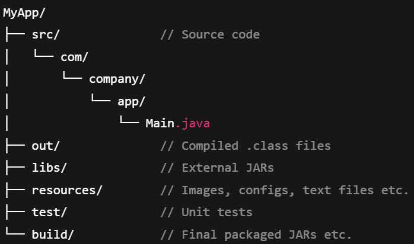
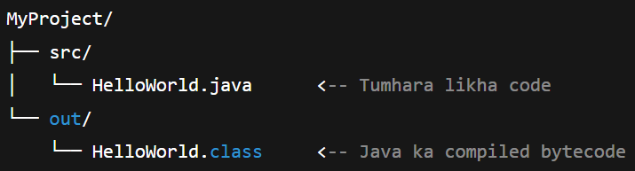
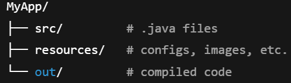
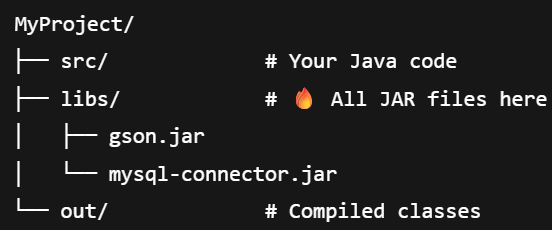

# Preparation before writing a JAVA program
* ## Set Environment Variables
  * #### PATH
    * This is must step
    * This let us to run the `javac` and `java` from anywhere in terminal.
    * ```   
        PATH = C:\Program Files\Java\jdk-XX\bin
  * #### CLASSPATH
    * Tells the JAVA to look for user defined classes and packages. 
* ## Project Directory Structure Creation
  1) **JAVA is package-sensetive**
   
   <br>

  2) **Best Practice to make directory**
       * **Package**
         * FolderName == PackageName
         * Ex `com.company.app → com/company/app/`
       * **Clean Structure**
         

    <br>

  3) **Separate `out` and `src`**
    
    * `src` -> source code folder
    * `out` -> output(compiled bytecode) folder
    * _Why?_
        1) Cleanliness
        2) IDE can debug easily as it know which code is where
        3) `javac` wont have to see `.class` just go in `src`
        4) `.jar` banana easy because directly uses `out` folder
   
   <br>

   4) Keep `resources/` out of `src/`
        
      * `resources/` contains images, xml, configs files 
      * These **non-code things** are loaded on runtime, _no need to compile them_
      * _Why `resources/`?_
        1) `javac` can directly look `.java` files, no need to see other non-coding files
        2) **Fast Loading** as all are separated, no confusion
        3) Code becomes **modular and reusable**
        4) Easy maintainence
    
   <br>

    5) **External Library**
        * These are those library we take from outside, **to add features**
        * ex 
          * `ysql-connector.jar` – MySQL se connect hone ke liye
          * `gson.jar` – JSON parsing
          * `log4j.jar` – Logging ke liye
          * `pdfbox.jar` – PDF banana ya read karne ke liye
         * `.jar` == **JAVA Archive** files
         * Keep these `.jar` files in `libs/` folder
         
         * _Why `libs/`?_
           1) Clean setup
           2) Better manangement
           3) Better dependency management, as we can see which project is using which library  

<br>
<br>
<br>

# Good Programming Practice
* #### Class Names
  * ex `Student`, `Trees`
* #### Variable Names
  * ex `age`, `width`, `elementName`
* #### Method Name
  * ex `run()`, `getElementName()`, `switchONtheButton()`
* #### Block Comments
  * Must be written in the starting of program and before any method
* #### Declaration
  * Declare one thing at a single line
    ```
    int height;
    int width;
    ```

<br>
<br>
<br>

# JAVA API  
* Ready-made library of tools and classes.
* Can use it instead of writing your owns

* #### How it is made?
  * It is **package of prewritten classes and methods**.
  * Language in which made = **JAVA**
  * ex `java.util`, `java.lang`, `java.io`
  * ex 
    ```
    String name = "Panya";
    System.out.println(name.toUpperCase());  // Output: PANYA
    ```
  * Here `toUpperCase()` is a method came from JAVA API.
  
* #### Benefits
  * Time saver
  * Reusable
  * Reliable
  * Clean Code
  
<br>
<br>
<br>

# JAVA Buzzwords
These are properties of JAVA
1) #### Simple 
   * Easy to learn, clean
2) #### Object-Oriented
   * Every thing is done using object
3) #### Robust
   * Strong error handling system, no memory leak
4) #### Secure
   * Code is runned on JVM, it is virus-proof
5) #### Platform Independent
6) #### High Performance
   * Interpreter + Just-in-Time Compiler, makes execution very fast
7) #### Distributed
   * Can make remote apps
8) #### Multithreaded
9) #### Dynamic	
    * Runtime pe naye classes, methods load kar sakte ho
10) #### Architecture Neutral
    * Bytecode specific machine ke liye nahi, har architecture pe chalega
11) #### Interpreted	
    * Java code pehle compile hota hai .class me, fir JVM use interpret karta hai
12) #### Portable	
    * Bina code change kare can run on any system
 
**Java is a platform-independent, object-oriented, secure and robust language with strong multithreading capabilities and a rich API ecosystem.**

<br>
<br>
<br>

# Types of Variables
## 1) Instance Variable

* Attached with some **object**
* Har object apna version rakhta hai

#### ❓Why we need it?
  * Object-oriented programming mein, **state ko store** karne ke liye. 
  * Har object apna data rakhe — isliye

#### 🚀 How it helps?
  * **Encapsulation allow** karta hai — har object apna data rakhta hai, kisi aur object se independent

#### 🧠 Memory behavior?
  * **Heap memory** mein store hota hai. 
  * Har object banne pe naya memory allocate hota hai.
  
#### ㊙️Syntax
##### Rules
  * Declaration class ke andar, methods ke bahar.
  * Access modifiers allowed (private, public, etc.)
  * Default values milte hain agar initialize na kiya ho.

#### 🔧Working under the scene
* JVM har object ke liye ek memory block banata hai jisme yeh variables ke slots hote hain.

#### 🧪 Use Case
* Kisi bhi real-world entity ka state store karna:
`Student, Car, Employee, BankAccount`.
* Har object apna alag data rakhega.

#### ❌ Common Errors
  ##### 1) NullPointerException — object not initialized
  * Object ka naam likh diya, par usko new keyword se banaya hi nahi
  ```
    Student s;  // sirf declare kiya
    System.out.println(s.name);  // ❌ Error: s abhi null hai
  ```
  **Debug Tip**
  ```
  Student s = new Student();  // ✅ Sahi tareeka
  System.out.println(s.name);
  ```
  ##### 2) Shadowing — same name causes confusion
  * if(instanceVarName == localVarName){
      then it prints the one it finds the first
    }
  * ex 
    ```
    public class Example {
      int value = 10;

      void show() {
          int value = 20;  // yeh local hai, instance wala shadow ho gaya
          System.out.println(value);  // output: 20, not 10
      }
    }
  * Use `this` if you want to print instance variable value.

  #### ⚡ Fast Debug Checklist
  -> 🧠 Jab bhi instance variable issue aaye:
  1) null toh nahi bhatak raha? 👻

  2) Naam same toh nahi rakha? 😵

  3) Console mein System.out.println() se value check karo 🧾

  4) this. use karo for printing instance var

#### 💼 Interviews + Code Challenges
**Interview Questions**:
1) What is the difference between instance and static variable?

2) How does memory behave for instance variables?

3) Why use this keyword?

4) Can we override instance variables? (Nope – methods override hote hain)

#### 🌍 Real World Usage
1)  **Spring Boot Entities (ORM - Hibernate/JPA)** 
Instance variables har database column hote hai. 
Each Row = object
    ```
    @Entity
    public class Student {
        @Id
        @GeneratedValue(strategy = GenerationType.IDENTITY)
        private Long id;               // instance variable
        private String name;          // instance variable
        private int marks;
    }
Kya ho raha hai?
* Har Student object = ek row in DB
* id, name, marks = instance vars → column values

| Use Case      | Variable Role               | Why Instance?            |
| ------------- | --------------------------- | ------------------------ |
| Spring Entity | Field = DB column           | Each row = object        |
| DTOs / Beans  | Holds request/response data | Per request values       |
| Android       | UI elements, states         | Each activity ke liye    |
| Games         | Player attributes           | Har player alag          |
| Servlets      | Dependency objects          | Share per object         |
| Threads       | Thread-local object data    | Alag instance, alag data |

<br>
<br>
<br>

## 2) Local Variable
### Definition
* Method ke andar ke var
* Attached with a **method/block**, not object
* Exist karta hai sirf execution ke dauraan

### ❓Why needed?
-> Stores temp data of method, then khatam after execution
* Jaise loop counters, intermediate calculation, input data store

### 🚀 How It Helps?
* **Memory efficient** — jaise hi method khatam, memory free

* Avoids polluting object state
    * Agar har chhoti claculation ke liye instance var(permanent var) banayenge toh bohot memory waste hogi

* Thread-safe by default (kyunki har thread ka apna stack hota hai)
  * Local var helps to **avoid race-condition** and **parallel execution** 
  * As each thread gets its separate copy of it. Because each thread has its own stack and local var are stored in stack.

### 🧠 Memory Behavior
* Store hota hai stack memory mein
* Method call hote hi ban jaata hai, method finish hote hi ud jaata hai
* JVM automatically manage karta hai (no need for cleanup)

### ㊙️ Syntax
  ```
  void func(){
    String name = "XYZ";
  }
  ```
  #### Rules
  * Declare inside method/block/constructor only
  * No access modifiers allowed (❌ private/public not allowed)
  * Initialization compulsory before use (varna compile-time error)

### 🔧 Under the scene
* JVM har method ke liye stack frame banata hai

* Us frame mein local variables ke liye slots allocate hote hain

* Method finish → frame destroy → variables bhi vanish 💨

### 🧪 Use Case
| Use Case         | Variable Role            | Why Local?                 |
| ---------------- | ------------------------ | -------------------------- |
| Loops            | Loop counters, iterators | Temporary values only      |
| Input Validation | Validation flags/data    | Limited scope              |
| Calculations     | Temp variables           | No need to store long-term |
| Recursion        | Call-specific state      | New value per call         |
| Event handling   | Button click msg etc.    | One-time use               |

### ❌ Common Errors
  #### 1) Uninitialized Variable Error
  * Initialize var every time we make it.
  
  #### 2) Shadowing
  ```
  int age = 30;

  void display() {
    int age = 25;  // local var shadowing instance var
    System.out.println(age);  // output: 25
  } 
  ```
  * It shadows the same instance var 
  * Use `this.age` if you want to access instance variable instead

### ⚡Fast Debug Checklist
✅ Initialized toh hai?
✅ Name clash toh nahi with instance var?
✅ Scope sahi hai? Outside method access toh nahi kar raha?
✅ Print karke dekh lo console mein (🖨️ debugging OG tool)


### 💼 Interviews + Code Challenges
#### Interview Questions:

1) Difference between local, instance, and static variables?

2) Where are local variables stored in memory?

3) Why can't we use access modifiers with local variables?

4) Can we return local variables from a method? (Yes, by value or reference)

### 🌍 Real World Usage
| Area          | Example                        | Local Variable Role        |
| ------------- | ------------------------------ | -------------------------- |
| Java Programs | Looping through lists          | `for(int i=0; ...)`        |
| Android Dev   | onClickListener logic          | Local response msg         |
| Games         | Calculating damage/temp values | Attack power etc.          |
| Backend       | Parsing request/response       | Local processing vars      |
| GATE/DSA      | Functions/Recursion            | Carry forward partial data |

<br>
<br>
<br>


# Thread and its stack memory
### Kya hoti hai Stack Memory?
* JVM har thread ke liye ek alag stack banata hai.
* Ye stack ke andar har method call ke liye ek stack frame banta hai.
<br>
* Stack frame mein hota hai:
  1) Local variables
  2) Method arguments
  3) Return address (method ke baad kaha jaana hai)

**Local variables are never shared between threads.**

<br>
<br>
<br>
<br>
<br>
<br>
Go to topic 
local → instance → static → this → encapsulation
