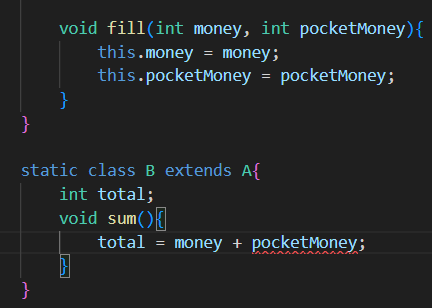
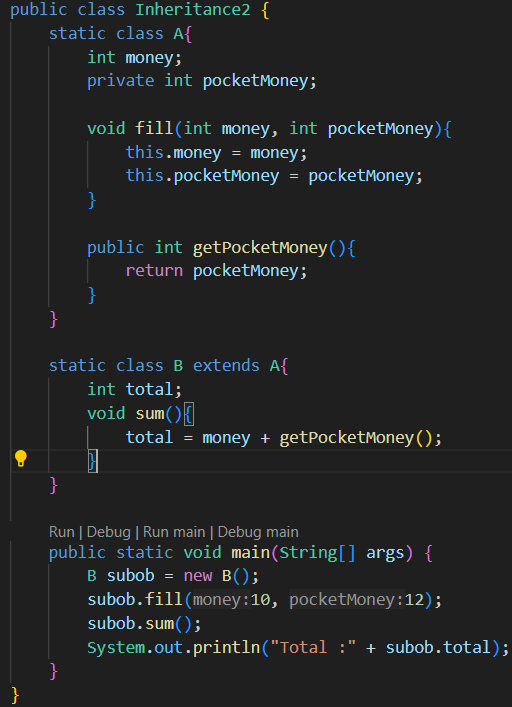

### Study

```
🧱 1. What It Is (Definition)
What is this concept?
Why does it exist?
How does it help?
Memory Behavior
Optimization
any latest tech for this

🛠️ 2. How It Works (Syntax + Internals)
What's the exact syntax?
Are there any rules, exceptions, or modifiers?
What does it translate to under the hood?

🧪 3. Use Cases
When and where would you use this in the real world?
What kind of projects, modules, or features demand it?

⚠️ 4. Common Pitfalls
What mistakes do people often make with this?
How do you debug them?

⚙️ 5. Related Concepts
What’s connected to this?
Can it be combined with other features?
What comes before/after this in the learning curve?

🔎 6. Behind the Scenes (Light Internals)
How does the language implement this?
What’s happening at compile-time/run-time?

After the study Practice

🧨 7. Interviews + Code Challenges
What kind of questions come up?
Can you solve small-medium problems using this?

🚀 8. Projects or Use in Real Code
Build something small using that concept
Read actual GitHub code where it's used
```

<br>
<br>
<br>

## What to study
- `static` wala part
    - Varibles
    - Methods
    - Class Members
    - Block
- `Access Modifier` ke baare mein sab
<br>
<br>
<br>
<br>
<br>


# JAVA Architecture (Contd.)
* Step1 -> Create java source code with `.java` extension

* Step2 -> Compile source code using java compiler, which will create bytecode file with `.class` extension 

* Step 3 -> Class loader reads both the user defined and library classes into memory for extension

* Step 4 -> Bytecode verifier validates all the bytecodes are valid and do not violate Java's security restrictions

* Step 5 -> JVM reads bytecodes and translates into machine code for execution. While execution of the program code will interact to OS and H/W

<br>

# The 5 phases of JAVA prog

### 1) Start 
* Write a `.java` program.
_This is the source code_
<br>


### 2) **Compiler**
* Compiles the java prog into bytecodes <br>_Simply, it work to make it platform independent_
`javac == java compiler`
    <br>
    ```
    The javac takes your .java file and translates it into bytecode.

    Bytecode is an intermediate code, platform-independent.

    This bytecode is stored in a file called FileName.class.
    ```
    * To compile the code we have to write `javac FileName.java`
<br>

### 3)  **Loader** 
* Is used to load the bytecode `.class` file into main memory (RAM)
    * It is done when we run the program `java FileName` 
  <br>

    ```mermaid
    flowchart TD
    A[Run program] --> B[Find .class] --> C[Loads .class in RAM] --> D[Manages Dependencies]
    
<br>

* **Managing Dependencies** 
    * It means if
   
        * as here another class is called from `Hello class`
        * Then it finds `Greeter class` and then creates it also.
    * This means when we run prog then
        1) Loads Hello.class.
        2) Then see the **dependency** of `Hello` on `Greeter`.
        3) Loads the `Greeter` also in memory.

    In simple words, 
    ``` 
    Managing Dependecy means it loads all the necessary classes on which the Main Class(which have main function) is dependent.
    ```
    
* ##### JAVA Dynamic Class Loading
    ```
    -> Class tabhi load karta hai jab jarurat hai, otherwise nahi
    -> Saves memory and speed ^
    ```

### 4) **Bytecode Verifier** 
* Verifies the bytecode for any error
* **Why we need it?**
  * Ensures safety and prevent malicious or malformed code(mistakewala code)
  * If the mistakewala code is runned it will crash the JVM
  * ##### Crashing JVM
    * Accessing private data

    * Corrupting memory

    * Violating access rules (private method ko call karna from different the class)

### 5) **Execute** 
* JVM uses combination of _interpretation_ and _just-in-time compilation_ to **translate** bytecodes into machine language
* Application is runned on the user's machine(ie. by interpreter)


<br>
<br>
<br>

# Classes and Object

### Member Variables

* Class never runs, object runs the program
* Variables declared in the class and outside the method of that class are called **Instance variable**.
* Variables declared in the method are called **Local variable**.
* _Class variables_ can be declared `static` but _local vaiable_ cannot be declared `static`.
<br>


### Static
The `static` means that the variable belongs to the class not to any object of that class.
* Ex _Non static = all student have diff name in class_ <br> _Static = all the student have same name in the school_
* Memory Behavior
    * The static variable lives in the method area not in the heap


## Object and Reference

* **Object** 
    Object is stored inside the heap data structure.
* **Object as Reference**
* **Object as Reference Variables** 
    <br>
    `Class_name obj = new Class_name();`
    * here `obj` stores the reference of the 'obj' object.
    * here `Class_name` is the constructor.

### `this` keyword
* Agar we have instance var and local var of same name, then we can use `this` to differentiate.
* We can call constructor from constructor using `this` keyword. 

    ``` 
    Constructor 1
    public Student() {
        this("Panya", 0);  //calls Constructor 2
        
    }

    // Constructor 2
    public Student(String name, int age) {
        this.name = name;
        this.age = age;
    } 
<br>

## Static Class Members
* Yeh aise members(var and methods) hote hai jo object se related nahi hote, yeh separate hote hai.
* Inhe use karna hoga toh <br>
    `ClassName.StaticVar` 
    `ClassName.StaticMethod()`
    <br> We have to use `.` operator to use them.

#### Static Variables
* Agar ek baar static var declare kar diya toh it will be same in all object.
* If we changed any static variable, then this change will be reflected in all objects of that class.

#### Static Methods
* Static Methods can directly access the static var.
* Static Method cannot access static var and static methods.
* Cannot use `this` and `super` references.

#### Static Block
* Static block gets executed when the JVM loads the code.


# Encapsulation/Abstraction
* We achieve **Encapsulation** by making data members(instance variables) `private`.


<br>
<br>
<br>

# Inheritance
#### 1) Single Inheritance
    class derived_class extends base_class{

    } 

* `Constructor` of base class is never inherited by the derived class.
* **Order of Calling the classes**
    ```mermaid
    flowchart TD
    A[Base Class] --> B[Derived Class]
    ```

<br>
<br>
<br>

# Some imp points
* **String**  (String datatype ki baat ho rahi hai) is treated as class in java.
<br>
* **Precedence of code execution**
    1️⃣ Static blocks and it's methods
    
    2️⃣ Static variables (in declaration order)  
    3️⃣ Static methods called during class loading (if any)  
    4️⃣ `main()` method  
    5️⃣ Instance variables and instance initializer blocks  
    6️⃣ Constructor (after object is created) 
<br>

* **Dynamic Class Loading** 
Java uses dynamic class loading, meaning classes are loaded only when needed — it saves memory and speeds up launch.

<br>
<br>
<br>

# Some Errors
###  1) Static Declaration Error
 
* Here it is giving error for `b` object but not for `a` because `class A` is written static.
* To resolve this error
    ```
    non-static variable this cannot be referenced from a static context(errors(1): 12:9-12:23)
    No enclosing instance of type Inheritance1 is accessible. Must qualify the allocation with an enclosing instance of type Inheritance1 (e.g. x.new A() where x is an instance of Inheritance1).Java(16777237)
    Inheritance1.​B
* Write static in the class name as written for `public static class A`
  
  <br>
  
###  2) If we have to access a `private` member of the `base class` from derived class
* Error looks like this
        
* then we have to create a public method in the base class which will return that private variable to the base class
        
* Here we wrote the function `getPocketMoney()` to return private variable `pocketMoney`.