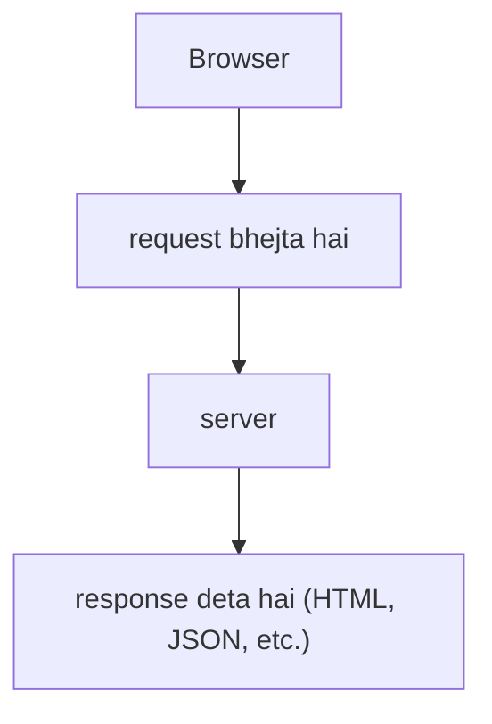
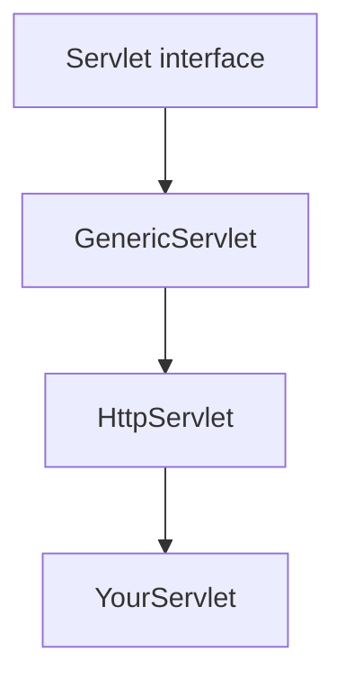

# 🚀 Servlet Kya Hai?
Servlet ek **Java program hai jo server pe run hota hai** aur browser (client) se aayi **request ko handle karke response bhejta hai**.

Soch le:
* Tu browser me type karta hai: `http://mysite.com/login`
* Ye **request server tak jaati** hai.
* **Server me ek Servlet** chal raha hota hai jo **check karega**:
    * User ka username/password correct hai ya nahi
    * Database se data nikaalega
    * Aur fir ek HTML response generate karke wapas browser ko bhej dega.

### 🌐 Short Definition
👉 “Servlet is a Java class that runs on the server, handles client requests, and generates dynamic responses (like HTML, JSON, etc.).”

### ⚡ Key Points
* Java-based → isiliye **platform independent**.
* Server-side technology → client (browser) ke liye response banata hai.
* Mostly **dynamic content ke liye use hota hai** (static HTML ke bajaye).

**Servlet ko chalane ke liye ek Servlet Container** (jaise Apache Tomcat) ki zaroorat hoti hai.

#### 💡 Ek line me yaad rakh:
“Servlet = Java ka waiter jo server ki kitchen me khada hai → order (request) leta hai → khana (response) bana ke client ko serve karta hai.”

<br>
<br>
<br>
<br>


# 📘 Introduction to Servlets (PDF Deep Dive)
## 1. Server-side Programming Basics
**Static transaction:**
Browser → server se HTML file maanga (index.html) → server file bhej diya → browser display.
👉 Always same content, boring aur fixed.

**Dynamic transaction:**
Browser → server ko request bheji (jaise OrderServlet) → server ne program run kiya → ho sakta hai DB se baat ki → HTML dynamically banaya → browser ko bhej diya.
👉 Har baar request pe alag/alag content.

## 2. Web Server
Ek computer **software** jo **HTTP protocol use karke client requests handle karta hai.**

### Famous web servers:
* Apache HTTP Server
* Microsoft IIS
* Sun Java System Server

## 3. Java Server-side Web Components
**Web component** = **software** jo web **server pe run** hota hai aur client **requests handle karta hai**.
J2EE specification ke **do main web components**:
* Servlets
* JSPs (Java Server Pages)

#### Think of it as:
**Servlet** = logic handle karta hai.
**JSP** = presentation (UI + HTML) handle karta hai.

## 4. What are Servlets?
Ek **Java class jo server pe run** hoti hai.
Client ki **request handle** karti hai aur **dynamic response generate** karti hai.
Platform independent (Java hai boss 😎).

## 5. Uses of Servlets
HTML **form data process** karna (e.g., login/signup).
**Dynamic content dena** (e.g., DB query results).
**State manage karna** (HTTP is stateless → shopping cart jaisi cheezon ke liye state track karna).

## 6. Servlet Architecture
Servlet banane ke liye **API packages**: `javax.servlet` & `javax.servlet.http`.
**Sabhi servlets** ko **Servlet interface implement karna** hota hai.

**Hierarchy**:


## 7. Writing and Deploying a Simple Servlet
**Steps** (Tomcat example):
* **Env variables set kar**o: JAVA_HOME, CATALINA_HOME, CLASSPATH, PATH.
* **Tomcat ke webapps folder me** apni **app ka folder banao**.
* Apna **servlet** (WelcomeServlet.java) **likho** aur **WEB-INF/classes me rakho.**
* `web.xml` **file banao aur WEB-INF me rakho**.
* **Tomcat start** karo.
* Browser me `http://localhost:8080/` kholke **check karo**.
* Apne **servlet ka URL test karo**:
`http://localhost:8080/MyWebApp/WelcomeServlet.`

## 8. Directory Structure
```
MyWebApp/
   WEB-INF/
       classes/   (all .class files)
       lib/       (jar files)
       web.xml    (deployment descriptor)
   index.html
   hello.jsp
```

## 9. Simple Servlet Example
```java
public class WelcomeServlet extends HttpServlet {
  public void doGet(HttpServletRequest req, HttpServletResponse res)
      throws ServletException, IOException {
    res.setContentType("text/html");
    PrintWriter pw = res.getWriter();
    pw.println("<h3>Welcome to Java Servlet Technology!!</h3>");
    pw.close();
  }
}
```

👉 Ye servlet har GET request pe ek HTML response bhej dega with welcome message.

## 10. `web.xml` (Deployment Descriptor)
**Servlet ko URL se link karne ke liye use hota hai.**
```xml
<web-app>
  <servlet>
    <servlet-name>MyFirstServlet</servlet-name>
    <servlet-class>WelcomeServlet</servlet-class>
  </servlet>
  <servlet-mapping>
    <servlet-name>MyFirstServlet</servlet-name>
    <url-pattern>/welcome.msg</url-pattern>
  </servlet-mapping>
</web-app>
```

## 11. Web Container (Servlet Engine)
**Execution environment** for servlets + JSPs.
#### Roles:
* Request/response communication
* Lifecycle management
* Multithreading (har request = new thread)
* Security handle karna
* JSP support

## 11.  Servlet Request Handling Flow
1. **Container ko request milti hai**.
2. **2 objects bante hain**: `HttpServletRequest` & `HttpServletResponse`.
3. **Right servlet find hota** hai based on **URL**.
4. **Naya thread** banta hai.
5. Servlet ka **`service()` method call** hota hai.
6. `service()` → `doGet()` ya `doPost()` **call** hota hai.
7. **Response** banta hai → **browser ko bhej diya jata** hai.
8. **Request/response objects delete** ho jaate hain.

## 12.  Servlet Life Cycle
3 phases:
1. `init()` → jab servlet **load** hota hai (ek baar).
2. `service()` → **har request ke liye** (multiple times).
   * Calls `doGet()` / `doPost()`.
3. `destroy()` → jab servlet **unload** hota hai (ek baar).

## 13.  Lifecycle Methods
* `init(ServletConfig)` → initialization.
* `service(ServletRequest, ServletResponse)` → request handle karna.
* `destroy()` → cleanup before shutdown.
* `getServletConfig()` → config info laata hai.
* `getServletInfo()` → servlet ka info (author, version, etc.).


## ✅ Summary:
**Servlet** = Java class jo server pe run hoti hai, request handle karti hai, aur dynamic response deti hai.
**Lifecycle** = init() → service() → destroy().
**Deployment** = Tomcat me WEB-INF/classes + web.xml.
**Container** = Servlet ko run aur manage karta hai.